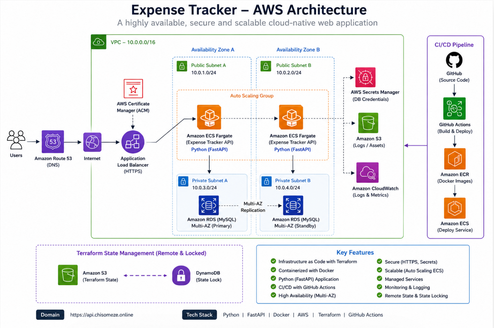
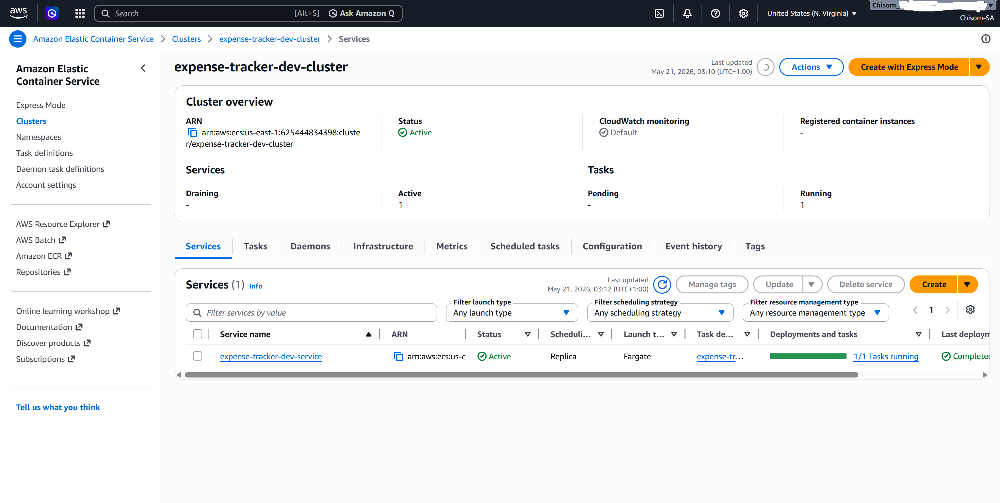
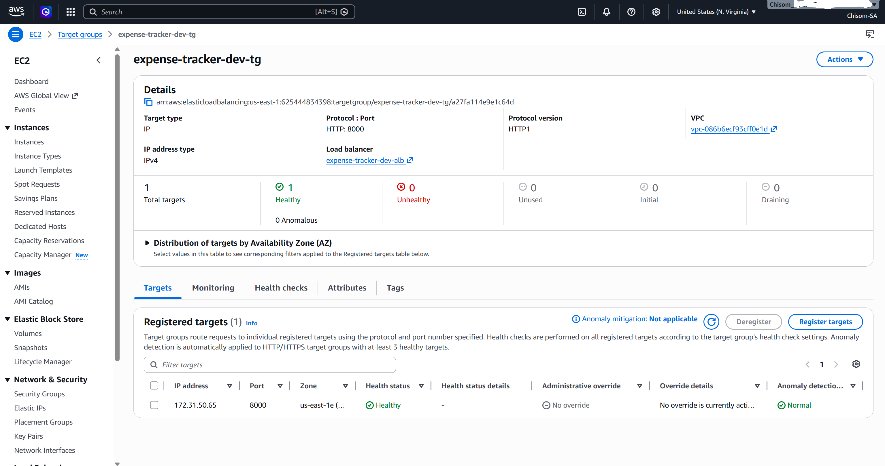
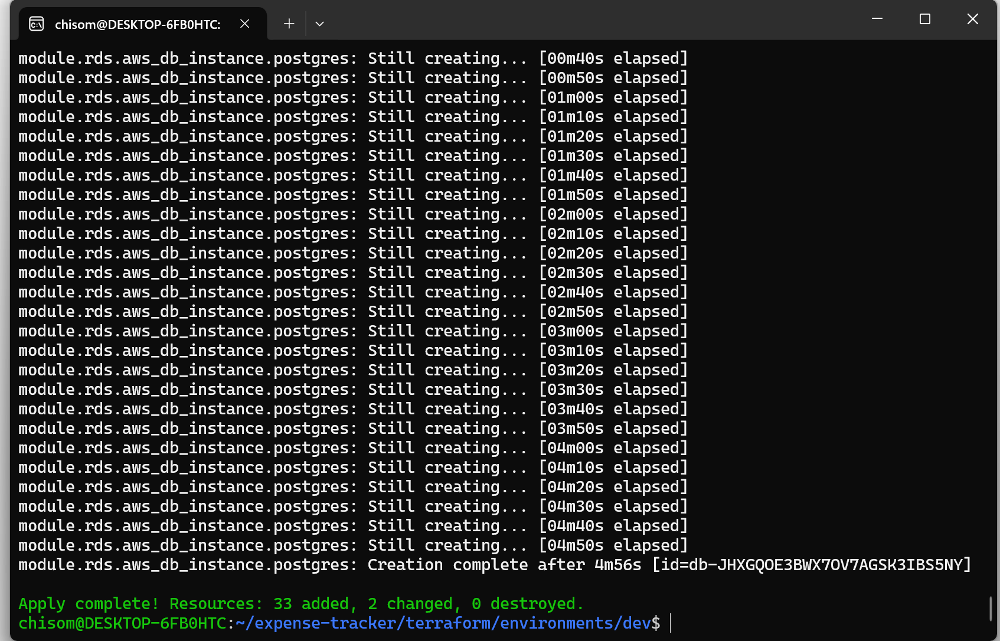
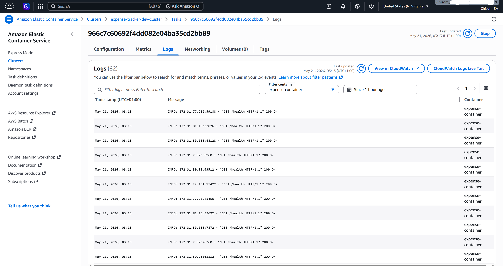
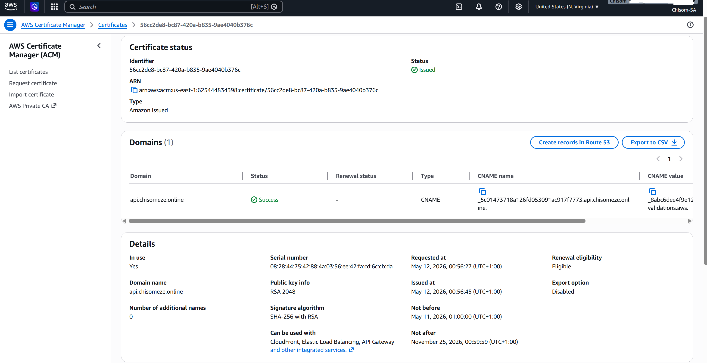

# Expense Tracker API Infrastructure

Production-oriented cloud-native deployment of a containerized FastAPI Expense Tracker API on AWS using Terraform, ECS Fargate, GitHub Actions CI/CD, and managed AWS networking/security services.

---

## Overview

This project demonstrates the design, provisioning, deployment, and operationalization of a modern backend API infrastructure using Infrastructure as Code (IaC) and container orchestration principles.

The application is deployed on AWS ECS Fargate behind an Application Load Balancer with HTTPS termination, automated CI/CD, remote Terraform state management, and centralized logging.

The goal of the project was not only to deploy an API, but to gain hands-on operational experience with:

- Infrastructure provisioning
- Immutable container deployments
- ECS service orchestration
- CI/CD automation
- Terraform state management
- Health checks and deployment stabilization
- Runtime debugging and observability

---

# Architecture

## High-Level Architecture

```
Client
   │
   ▼
Route53 DNS
   │
   ▼
Application Load Balancer (HTTPS)
   │
   ▼
ECS Fargate Service
   │
   ▼
FastAPI Container
   │
   ▼
Amazon RDS PostgreSQL
```
<p align="center">
  
</p>
---

# AWS Services Used

| Service | Purpose |
|---|---|
| ECS Fargate | Container orchestration |
| ECR | Docker image registry |
| ALB | Load balancing & HTTPS routing |
| ACM | SSL/TLS certificate management |
| Route53 | DNS management |
| RDS PostgreSQL | Managed relational database |
| CloudWatch Logs | Centralized container logging |
| Secrets Manager | Secure runtime secret injection |
| S3 | Terraform remote state storage |
| DynamoDB | Terraform state locking |

---

# Tech Stack

## Backend
- FastAPI
- PostgreSQL
- SQLAlchemy
- Uvicorn
- Swagger/OpenAPI

## Infrastructure
- Terraform
- AWS ECS Fargate
- Docker
- Route53
- Application Load Balancer
- ACM Certificates

## CI/CD
- GitHub Actions
- Docker Build & Push
- Immutable ECS deployments

---

# Infrastructure Highlights

## Modular Terraform Architecture

Infrastructure was provisioned using reusable Terraform modules for:

- Networking
- ECS
- IAM
- ALB
- ACM
- DNS
- Monitoring
- RDS
- Secrets Management
- Remote Backend

---

## Remote Terraform State

Terraform state management was implemented using:

- S3 backend storage
- DynamoDB state locking

This prevents:
- concurrent Terraform modifications
- local state corruption
- accidental drift

---

## Immutable Deployments

The deployment workflow follows immutable deployment principles.

Each GitHub Actions pipeline:
1. Builds a new Docker image
2. Pushes image to Amazon ECR
3. Updates ECS task definition
4. Deploys new ECS task revision

This avoids:
- in-place server modifications
- deployment inconsistencies
- configuration drift

---

# CI/CD Workflow

## Deployment Flow

```
GitHub Push
    │
    ▼
GitHub Actions
    │
    ▼
Docker Build
    │
    ▼
Push Image to ECR
    │
    ▼
Update ECS Task Definition
    │
    ▼
ECS Rolling Deployment
```

---

# Features

- RESTful Expense Tracker API
- Swagger/OpenAPI documentation
- HTTPS-enabled deployment
- Containerized backend runtime
- ECS rolling deployments
- Health-check based traffic routing
- Secure secret injection via AWS Secrets Manager
- Centralized CloudWatch logging
- Automated CI/CD pipeline
- Infrastructure as Code using Terraform

---

# Project Screenshots

## Infrastructure & Deployment

### ECS Service Deployment
Shows ECS service status, running tasks, deployment health, and service stabilization.
<p align="center">
  
</p>
```text
screenshots/ecs-service.png
```

---

### ALB Target Group Health
Shows healthy registered ECS targets behind the Application Load Balancer.
<p align="center">
  
</p>
```text
screenshots/alb-target-health.png
```

---

### GitHub Actions CI/CD Pipeline
Shows successful immutable deployment pipeline execution.
<p align="center">
  
</p>
```text
screenshots/github-actions-success.png
```

---

### Terraform Apply
Shows successful infrastructure provisioning via Terraform.
<p align="center">
  
</p>
```text
screenshots/terraform-apply.png
```

---

### CloudWatch Logs
Shows centralized ECS container logging and runtime observability.
<p align="center">
  
</p>
```text
screenshots/cloudwatch-logs.png
```

---


### Route53 DNS & ACM Validation
Shows HTTPS domain validation and DNS integration.
<p align="center">
  
</p>
```text
screenshots/route53-acm.png
```

# Operational Concepts Practiced

This project involved hands-on experience with:

- ECS task lifecycle debugging
- Runtime Secrets injection
- ALB target health troubleshooting
- ECS deployment stabilization
- Container runtime validation
- Terraform drift handling
- Route53 certificate validation
- Terraform remote backend recovery
- ECS image pull failures
- CloudWatch log inspection
- Immutable deployment strategies

---

# API Documentation

Swagger/OpenAPI documentation is exposed through:

```
/docs
```

Health endpoint:

```
/health
```

---

# Screenshots To Include

Add screenshots for:

- Swagger/OpenAPI docs
- ECS Service overview
- ECS healthy task
- ALB healthy target
- GitHub Actions successful deployment
- Terraform apply output
- CloudWatch Logs
- AWS Architecture Diagram

---

# Local Development

## Clone Repository

```bash
git clone https://github.com/Chisom-Eze/expense-tracker-api
cd expense-tracker
```

---

## Run Application

```bash
docker compose up --build
```

---

# Terraform Deployment

## Initialize Terraform

```bash
terraform init
```

---

## Validate Configuration

```bash
terraform validate
```

---

## Review Plan

```bash
terraform plan
```

---

## Apply Infrastructure

```bash
terraform apply
```

--- 

# Future Improvements

Potential future enhancements:

- WAF integration
- Autoscaling policies
- Monitoring dashboards
- Canary/Blue-Green deployments
- Prometheus/Grafana observability
- Automated integration testing
- Frontend application integration

---

# Author

Chisom Eze

Cloud / DevOps / Platform Engineering Projects
